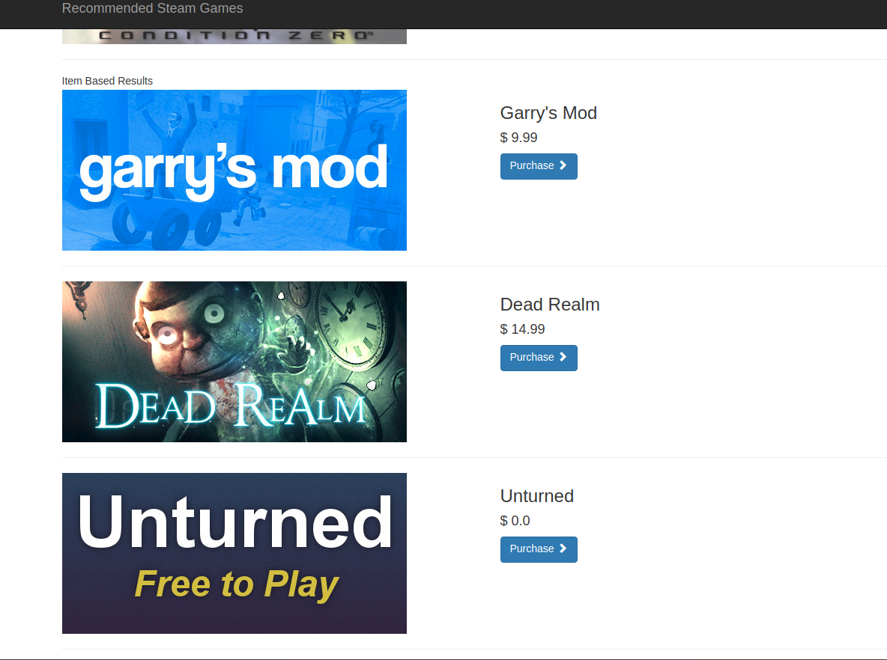

# recommendation_system_dal
This is a recommendation system for stem users. It contains:
- Content-based filtering (description-based and user's purchase activity based)
- Collaborative filtering
- Popular based filtering (for new users)

